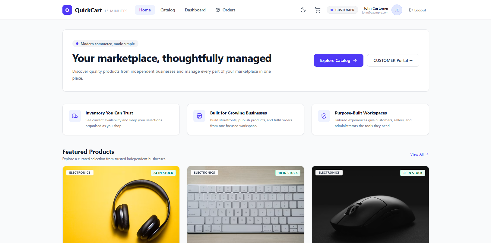

# 🛒 E-commerce app
**live:** https://e-commerce-ynav.onrender.com/

A modern and responsive full-stack e-commerce application designed to provide a smooth online shopping experience. Users can browse products, view detailed product information, manage their cart, place orders, and track their purchases.

The application also includes role-based functionality for managing products, customers, orders, and other e-commerce operations.

## ✨ Features
🔐 User registration and authentication
🛍️ Product browsing and product details
🔎 Product search and filtering
🛒 Add to cart and cart management
📦 Order placement and order management
📱 Responsive design for desktop, tablet, mobile and more
👨‍💼 Admin/product management
📊 Admin/Customer/Seller management dashboard
🛠️ Technologies Used
Frontend: React.js, JavaScript, HTML, CSS
Styling: Tailwind CSS / Bootstrap
Backend: REST API
HTTP Client: Axios
Build Tool: Vite
Database: JSON Server / Database
Deployement: Render services

## 🚀 Getting Started

**Prerequisites:**  Node.js

1. Clone the repository
   `git clone https://github.com/priyanshoe/e-commerce.git`
2. Install dependencies:
   `cd e-commerce`
   `npm install`
3. Set the `VITE_API_KEY` in [.env.local](.env.local) to your backend api url
4. Run the app:
   `npm run dev`
5. Run the server:
   `npm run dev:server`

# 📌 Project Purpose

This project was built to demonstrate the development of a complete e-commerce platform using modern web development technologies, focusing on responsive UI, reusable React components, API integration, state management, authentication, and real-world e-commerce workflows.